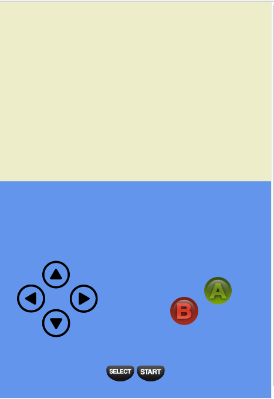

# Old School Gameboy Controls 

[](https://travis-ci.org/JimTheMan/Old-School-Gameboy-Controls)

_A leightweight Javascript library for adding 90's era gameboy-esque input controls to HTML5 games!_


_Note: This projet is still a work-in-progress._


## Current State of Gamebody controls



Currently, I have the _up, left, right, and down arrow_ buttons on the page. I also  have the A, B, start, and select buttons in. After having a had a breakthrough with the way I was dispatching Keyboard Events and listening for mouse / touch events, I'm now moving on to polishing off the controls, writing a detailed guide for integrating into your HTML5 game, and creating a sample game with the controls myself!


## Motivation For Gameboy Controls
This is a normal div and lives outside of the phaser game.
The whole point of this is so that the gameboy controls can have a window (where the gameboy screen would be) that the user
can just drop their main div in which phaser gets rendered and code as usual. This way the creator can simply build
the game listening for arrow key press events and easily have a way to let the user trigger those keypress events on 
mobile devices by simply pressing the gameboy buttons.

## Live Demo
Checkout the live demo here: https://jimtheman.github.io/Old-School-Gameboy-Controls/

If the spinning mushroom moves when you click down on the arrow button then you know that it works! Your device is registering the normal phaser keydown and keyup events!


### Mappings
<table>
    <tr><th>Gameboy button</th><th>QWERTY mapping</th></tr>
    <tr><td>Up arrow</td><td>up arrow</td></tr>
    <tr><td>Down arrow</td><td>down arrow</td></tr>
    <tr><td>Left arrow</td><td>right arrow</td></tr>
    <tr><td>Right arrow</td><td>left arrow</td></tr>
    <tr><td>A</td><td>a</td></tr>
    <tr><td>B</td><td>s</td></tr>
    <tr><td>Start</td><td>p</td></tr>
    <tr><td>Select</td><td>Escape</td></tr>
</table>


#### How To Use Gameboy Controls in Another Project (WIP)
I'm imagining a syntax where you can just wrap your main root game tag named "content" or "app" or something and wrap that in
another div marked as gameboy-controls. Then you just add the gameboy-controls (or possibly it happens behind the scenes).

```
<!DOCTYPE html>
<html lang="en">

<head>
    <meta charset="UTF-8">
    <title>Example Of Simple Index.Html With Game Controls/title>
</head>

<body>
    <script src="./gameboy-controls.js"></script>

    <div id="gameboy-controls">
        <div id="content"></div>
    </div>

<script type="text/javascript" src="./dist/vendor.bundle.js"></script><script type="text/javascript" src="./dist/bundle.js"></script></body>

</html>

```


Then in your phaser code listen for the arrow keys as usual.

```
      this.game.input.keyboard.onDownCallback = (e) => {
          console.log('Phaser game heard key DOWN event for ' + e.key +
             " keycode: " + e.keyCode + ", charCode: " + e.charCode);

          
          if (e.keyCode === 38) {       // up arrow key
            this.mushroom.x = Math.floor(Math.random() * this.world.bounds.width);
            this.mushroom.y = Math.floor(Math.random() * this.world.bounds.height);
          }

      }
```


The images are svg and should scale based on the viewport width to any portrait-layout sreen without degrading quality. 


$ Contributing To Old-School Gameboy Controls

Feel free free to open issues if you have any questions or suggestions!

The sample project was scaffolded with Phaser + ES6 + Webpack.

[](https://github.com/feross/standard)


## Features
- ESLINT with JavaScript Standard Style configuration
- Next generation of Javascript
- Browsers are automatically updated as you change project files
- Webpack ready
- WebFont Loader


## Setup

### 1. Install node.js and npm:

https://nodejs.org/en/


### 2. Navigate into the sample-phaser project folder

`cd sample-phaser-project`


### 3. Install dependencies (optionally you can install [yarn](https://yarnpkg.com/)):

Run:

```npm install``` 

or if you chose yarn, just run ```yarn```


### 4. Run the development server:

Run:

```npm run dev```

This will run a server so you can run the game in a browser. It will also start a watch process, so you can change the source and the process will recompile and refresh the browser automatically.

To run the game, open your browser and enter http://localhost:3000 into the address bar.


### Build for deployment:

Run:

```npm run deploy```


_Current build is sort of hackish. You may need to go into build/index.html and change game-controls path to "./gameboy-controls.js"_


## Deploy to gh-pages

From the root fo the project run this:

`git subtree push --prefix sample-phaser-project/build/ origin gh-pages`

This will optimize and minimize the compiled bundle.

### Deploy for cordova:
Make sure to uncomment the cordova.js file in the src/index.html and to update config.xml with your informations. (name/description...)

More informations about the cordova configuration:
https://cordova.apache.org/docs/en/latest/config_ref/

There is 3 platforms actually tested and supported : 
- browser
- ios
- android

First run (ios example):

```
npm run cordova
cordova platform add ios
cordova run ios
```

Update (ios example):

```
npm run cordova
cordova platform update ios
cordova run ios
```

This will optimize and minimize the compiled bundle.

## Config:
before you get to work you will surely want to check the config file. You could setup dimensions, webfonts, etc

## Webfonts:
In the config file you can specify which webfonts you want to include. In case you do not want to use webfonts simply leave the array empty

## Credits
Big thanks to these great repos:

https://github.com/belohlavek/phaser-es6-boilerplate

https://github.com/cstuncsik/phaser-es6-demo

## Contributors

- https://github.com/jimtheman
- https://github.com/psyrotix
